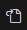

##  *-----------{ CONFIGURAÇÕES VSCODE }----------*

<!-- Comentário segue padrão do HTML-->

<b>Python</b>

**COFIGURAÇÕES VSCODE PARA PYTHON**  

+ Para visualizar em tempo real as modificações de Markdown no VSCode utilizamos os atalhos `ctrl`+`k` e `v`.

+ As configurações aqui apresentadas servem para todos os sistemas operacionais

+ Configurações em arquivo no VSCode aparecem quando cilcamos no ícone. 
 O arquivo é o `settings.json`
---

+ Por padrão o VSCode utiliza `compact folders` que exibe a estrutura de pastas com seu caminho completo. Para desativar essa opção clicamos em `configurações -> settings` e procuramos por compact foldes e então desabilitamos.
---

+ Atalhos
> Copy Line Down `Shift`+`Alt`+`DownArrow`  
> Copy Line Up `Shift`+`Alt`+`UpArrow`

+ Para executar a xtensão no terminal e não na output do VSCode, devemos setar a opção `code-runner.runbInTerminal` para `true`, por padrão ela vem setada como false.
---

+ Extensões
> Extensão para Python `Python`  
> Extensão para executar diversas linguagens `Code Runner`
---

<b>JavaScript</b>

